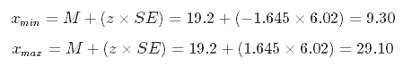
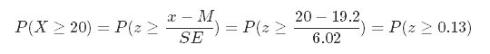
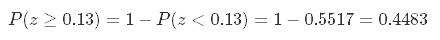

```{r setup, include=FALSE}
knitr::opts_chunk$set(echo = TRUE, background = '#F2D5B8')
options(scipen = 10) # only numbers with more than 10 digits are converted to scientific form
```
## Introduction & Summary

This is the Final Project submission for Udacity's [Intro to Descriptive Statistics](https://www.udacity.com/course/intro-to-descriptive-statistics--ud827) course. For more information, please see the [Project Overview](https://docs.google.com/document/d/1059JMJ9C5dn7vKUrmfWYle57Ai3Uk9PzxPQBGj5drjE/pub?embedded=true) and the [Project Rubric](https://docs.google.com/document/d/1gVCBsThTXBkUtMiccc4Rj5XT8I9h4ji0bpqTe2uUxRg/pub).

For this project, the R programming language is used to draw **100 independent samples of 3 cards** from a standard deck of 52 playing cards, each with a pre-assigned value. For each sample, the values of the 3 cards are added up.  
This **sampling distribution of value sums** is visualized with a histogram, and its **mean, median and mode** are found to be **19.2, 20 and 21** respectively.

Assuming that our sampling distribution is normally distributed, we estimate 90% of our sample's value sums will  
fall between **9 and 29**. The probability of drawing a sample with a value sum over 20 is about **0.4483**.

## Background

This project involves a standard deck of playing cards, containing 52 cards divided into four suits (spades, hearts, diamonds, and clubs), each suit containing 13 cards (Ace, numbers 2-10, and face cards Jack, Queen, and King). 

For this project, each card is assigned a value: 

* the *Ace* has a value of 1
* the *numbered cards (2 to 10)* assumes their printed value
* the *face cards (Jack, Queen, King)* each has a value of 10

The objectives of this project is to:

1. Understand the distribution of card values
2. Construct a sampling distribution of sums (of card values) based on cards drawn at random
3. Establish descriptive statistics of the sampling distribution of sums
4. Derive estimates about future samples

Additional libraries used for this project are as follows:

```{r libraries, message = FALSE}
library(knitr)
library(pander)
library(dplyr)
```

## 0. Building a Virtual Deck of Cards for Sampling

In the absence of a physical deck of cards, the *R* programming language may be used to construct a virtual deck of cards in the form of a data frame `deck`, which contains two columns:

* **card**: the name of the card
* **value**: the value assigned to the card

```{r deck}
# names of cards for each suit
suit <- rep(c("Spades", "Hearts", "Clubs", "Diamonds"), each = 13)
face <- c("Ace", 2:10, "Jack", "Queen", "King")
card <- paste(face, "of", suit)

# values from Ace to King
value <- c(1:10, 10, 10, 10)

# 'value' vector will recycle for each suit
deck <- data.frame(card, value, stringsAsFactors = FALSE)

# only the first and last few cards are shown below
```
```{r deck head, echo = FALSE, fig.width=5, fig.align='center'}
set.caption("First 21 cards of deck")
pander(cbind(deck[1:7, ], deck[8:14, ], deck[15:21, ]))
decktail <- cbind(deck[39:45, ], deck[46:52, ])
rownames(decktail) <- NULL
set.caption("Last 14 cards of deck")
pander(decktail)
```

## 1. Relative Frequencies of Card Values

The  frequencies of the card values in `deck` are shown in the following table and histogram:

```{r values table, echo = FALSE, fig.align = 'center'}
values_freq <- deck$value %>% 
    table() %>% 
    prop.table() %>% 
    round(4)
set.caption("Relative frequency of card values in a 52-card deck")
pander(values_freq)
```

```{r values hist, echo = FALSE, fig.align = 'center'}
hist(deck$value, freq = FALSE, col = "maroon",
     breaks = seq(0.5,10.5,1), axes = FALSE,
     main = "Distribution of Card Values",
     xlab = "Card value", ylab = "Relative Frequency")
axis(side = 1, at = 1:10, line = -0.3)
axis(side = 2, line = -0.7, las = 1)
```

## 2. Drawing Cards from the Deck
<!-- Now, we will get samples for a new distribution. To obtain a single sample, shuffle your deck of cards and draw three cards from it. (You will be sampling from the deck without replacement.) Record the cards that you have drawn and the sum of the three cards' values. Replace the drawn cards back into the deck and repeat this sampling procedure a total of at least thirty times. -->
A single sample is made by randomly drawing 3 cards from `deck` without replacement.  
The cards and the sum of their values may be recorded as shown below:

```{r test sample}
set.seed(2000) # example seed
draw_0 <- dplyr::sample_n(deck, 3)
print(draw_0$card)
paste('Sum of card values:', sum(draw_0$value))
```

For this project, **100** independent samples are drawn.  
The cards in each sample are tabulated, along with the sum total of their card values:

*For purposes of reproducibility, the drawing of cards in this instance will be based on fixed seeds, by calling the `set.seed()` function prior to sampling the cards from `deck`.*

```{r 100 samples}
# initial vector of sample sums
sample_sums <- numeric(0)

# initial table of drawn cards
cards_drawn <- data.frame()

for(i in 1:100) {
    set.seed(i)                # fixed seeds for reproducibility
    draw <- sample_n(deck, 3)
    cards_drawn <- rbind(cards_drawn, draw$card, stringsAsFactors = FALSE)
    sample_sums <- c(sample_sums, sum(draw$value))
}
cards_drawn <- cbind(cards_drawn, sample_sums)
names(cards_drawn) <- c("Card 1", "Card 2", "Card 3", "Sum")
set.caption("First 6 samples drawn from the deck, with replacement")
pander(head(cards_drawn))      # show only the first 6 samples
```

## 3. Sampling Distribution of Card Value Sums
<!-- 
3. Let's take a look at the distribution of the card sums. Report descriptive statistics for the samples you have drawn. Include at least two measures of central tendency and two measures of variability.
-->
To better understand the distribution of value sums of our card samples (known as a *sampling distribution*), we first calculate a few statistics for our sampling distribution. The **mean** and **median** are measures of *central tendency*, the **interquartile range** and **standard error** are measures of *variability*.

Note that the standard error is calculated using the formulae for sample standard deviation, as the samples we have drawn do not constitute the entire population of `r choose(52, 3)` possible 3-card draws from a 52-card deck.
<!-- reformat no. of combinations in appropriate form-->

```{r sum stats}
card_stats <- data.frame(
    list(Mean = mean(sample_sums),
         Median = median(sample_sums),
         Standard_Error = sd(sample_sums),
         # IQR = median of upper half - median of lower half
         Interquartile_Range = sort(sample_sums)[75] - sort(sample_sums)[25])
)

pander(card_stats)
```


## 4. Visual Distribution of Card Value Sums
<!-- 4. Create a histogram of the sampled card sums you have recorded. Compare its shape to that of the original distribution. How are they different, and can you explain why this is the case? -->

For comparison, we bring up the **distribution of card values**:

```{r ref.label= 'values hist', echo = FALSE, fig.align = 'center'}
```

It is clear that the distribution of card values is negatively skewed, since the most frequent card value is 10, but all other card values are below 10 and occur less frequently. This creates a tail on the left side of the distribution. Consequently, the mean and median of the card values are also significantly lower than the mode:

```{r values stats, echo = FALSE}
card_values <- summarise(deck, 
          Mean     = mean(value),
          Median   = median(value),
          Mode     = 10)
pander(card_values)
```
***
Next, the **sampling distribution of value sums** is visualised in the following histogram:

```{r sum hist, echo = FALSE, fig.align = 'center'}
sumrange <- range(cards_drawn$Sum)
hist(cards_drawn$Sum, freq = FALSE, col = "orange",
     breaks = seq(sumrange[1], sumrange[2], 4), axes = FALSE,
     main = "Sampling Distribution of Card Value Sums",
     xlab = "Card Value Sum", ylab = "Relative Frequency")
axis(side = 1, at = seq(sumrange[1], sumrange[2], 2), line = -0.3)
axis(side = 2, line = -0.7, las = 1)
```

The sampling distribution of card value sums begin to resemble a normal distribution, with the mean, median and mode values closer to each other. However, the sample size of this distribution is only 3, so the approximation to a normal distribution is not very strong.

```{r sum stats 2, echo = FALSE}
# find modal value sum by inspecting table
# table(sample_sums)

card_stats2 <- summarise(cards_drawn, 
          Mean     = mean(Sum),
          Median   = median(Sum),
          Mode     = 21)
pander(card_stats2)
```


## 5. Estimates of Future Draw Values
<!-- Make some estimates about values you will get on future draws. Within what range will you expect approximately 90% of your draw values to fall? What is the approximate probability that you will get a draw value of at least 20? Make sure you justify how you obtained your values. -->

Here are the statistics for our sampling distribution of sums for reference:

```{r ref.label = 'sum stats', echo = FALSE}
```

Assuming that our sample sums are normally distributed, we expect 90% of our draw values to fall within the 5th to the 95th percentiles. From the z-table, the 5th and 95th percentiles correspond to the z-values of -1.645 and 1.645 respectively. Given the mean and standard error of our distribution, we can calculate the lower and upper limits of our values:

```{r include = FALSE}
qnorm(c(0.05, 0.95), card_stats$Mean, card_stats$Standard_Error)
```



Therefore, 90% of our draw values should fall in **between 9 and 29** (rounded to the nearest integer).

***  

The probably of a draw value of at least 20 can be rewritten in terms of z-value:



Using the z-table, subtract the given probability from 1 to obtain the probability of a draw value of at least 20, which is **0.4483**:

