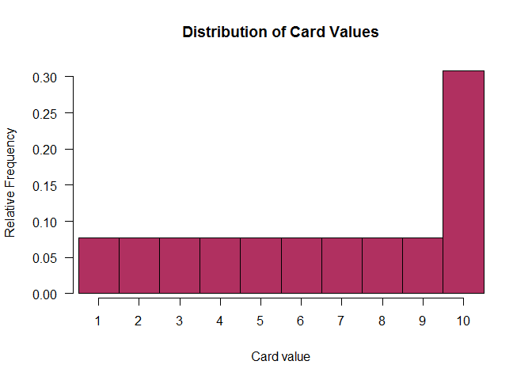
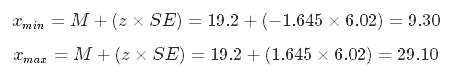
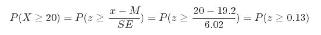
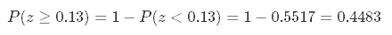

Intro to Descriptive Statistics - Final Project
================
YC Ng

-   [Introduction](#introduction)
-   [Background](#background)
-   [0. Building a Virtual Deck of Cards for Sampling](#building-a-virtual-deck-of-cards-for-sampling)
-   [1. Relative Frequencies of Card Values](#relative-frequencies-of-card-values)
-   [2. Drawing Cards from the Deck](#drawing-cards-from-the-deck)
-   [3. Sampling Distribution of Card Value Sums](#sampling-distribution-of-card-value-sums)
-   [4. Visual Distribution of Card Value Sums](#visual-distribution-of-card-value-sums)
-   [5. Estimates of Future Draw Values](#estimates-of-future-draw-values)

Introduction
------------

This is the Final Project submission for Udacity's [Intro to Descriptive Statistics](https://www.udacity.com/course/intro-to-descriptive-statistics--ud827) course. For more information, please see the [Project Overview](https://docs.google.com/document/d/1059JMJ9C5dn7vKUrmfWYle57Ai3Uk9PzxPQBGj5drjE/pub?embedded=true) and the [Project Rubric](https://docs.google.com/document/d/1gVCBsThTXBkUtMiccc4Rj5XT8I9h4ji0bpqTe2uUxRg/pub).

Background
----------

This project involves a standard deck of playing cards, containing fifty-two cards divided into four suits (spades, hearts, diamonds, and clubs), each suit containing thirteen cards (Ace, numbers 2-10, and face cards Jack, Queen, and King).

For this project, each card is assigned a value:

-   the Ace has a value of 1
-   the numbered cards (2 to 10) assumes their printed value
-   the face cards (Jack, Queen, King) each has a value of 10

The objectives of this project is to:

1.  Understand the distribution of card values
2.  Construct a sampling distribution of sums (of card values) based on cards drawn at random
3.  Establish descriptive statistics of the sampling distribution of sums
4.  Derive estimates about future samples

Additional libraries used for this project are as follows:

``` r
library(knitr)
library(pander)
library(dplyr)
```

0. Building a Virtual Deck of Cards for Sampling
------------------------------------------------

In the absence of a physical deck of cards, the *R* programming language may be used to construct a virtual deck of cards in the form of a data frame `deck`, which contains two columns:

-   **card**: the name of the card
-   **value**: the value assigned to the card

<!-- use the pander package to reformat my tables -->
``` r
# names of cards for each suit
suit <- rep(c("Spades", "Hearts", "Clubs", "Diamonds"), each = 13)
face <- c("Ace", 2:10, "Jack", "Queen", "King")
card <- paste(face, "of", suit)

# values from Ace to King
value <- c(1:10, 10, 10, 10)

# 'value' vector will recycle for each suit
deck <- data.frame(card, value, stringsAsFactors = FALSE)

# only the first and last few cards are shown below
```

<table style="width:29%;">
<colgroup>
<col width="19%" />
<col width="9%" />
</colgroup>
<thead>
<tr class="header">
<th align="center">card</th>
<th align="center">value</th>
</tr>
</thead>
<tbody>
<tr class="odd">
<td align="center">Ace of Spades</td>
<td align="center">1</td>
</tr>
<tr class="even">
<td align="center">2 of Spades</td>
<td align="center">2</td>
</tr>
<tr class="odd">
<td align="center">3 of Spades</td>
<td align="center">3</td>
</tr>
<tr class="even">
<td align="center">4 of Spades</td>
<td align="center">4</td>
</tr>
<tr class="odd">
<td align="center">5 of Spades</td>
<td align="center">5</td>
</tr>
<tr class="even">
<td align="center">6 of Spades</td>
<td align="center">6</td>
</tr>
<tr class="odd">
<td align="center">7 of Spades</td>
<td align="center">7</td>
</tr>
</tbody>
</table>

<table style="width:35%;">
<colgroup>
<col width="25%" />
<col width="9%" />
</colgroup>
<thead>
<tr class="header">
<th align="center">card</th>
<th align="center">value</th>
</tr>
</thead>
<tbody>
<tr class="odd">
<td align="center">7 of Diamonds</td>
<td align="center">7</td>
</tr>
<tr class="even">
<td align="center">8 of Diamonds</td>
<td align="center">8</td>
</tr>
<tr class="odd">
<td align="center">9 of Diamonds</td>
<td align="center">9</td>
</tr>
<tr class="even">
<td align="center">10 of Diamonds</td>
<td align="center">10</td>
</tr>
<tr class="odd">
<td align="center">Jack of Diamonds</td>
<td align="center">10</td>
</tr>
<tr class="even">
<td align="center">Queen of Diamonds</td>
<td align="center">10</td>
</tr>
<tr class="odd">
<td align="center">King of Diamonds</td>
<td align="center">10</td>
</tr>
</tbody>
</table>

1. Relative Frequencies of Card Values
--------------------------------------

The frequencies of the card values in `deck` are shown in the following table and histogram:

<table style="width:97%;">
<colgroup>
<col width="9%" />
<col width="9%" />
<col width="9%" />
<col width="9%" />
<col width="9%" />
<col width="9%" />
<col width="9%" />
<col width="9%" />
<col width="9%" />
<col width="9%" />
</colgroup>
<thead>
<tr class="header">
<th align="center">1</th>
<th align="center">2</th>
<th align="center">3</th>
<th align="center">4</th>
<th align="center">5</th>
<th align="center">6</th>
<th align="center">7</th>
<th align="center">8</th>
<th align="center">9</th>
<th align="center">10</th>
</tr>
</thead>
<tbody>
<tr class="odd">
<td align="center">0.0769</td>
<td align="center">0.0769</td>
<td align="center">0.0769</td>
<td align="center">0.0769</td>
<td align="center">0.0769</td>
<td align="center">0.0769</td>
<td align="center">0.0769</td>
<td align="center">0.0769</td>
<td align="center">0.0769</td>
<td align="center">0.3077</td>
</tr>
</tbody>
</table>


2. Drawing Cards from the Deck
------------------------------

<!-- Now, we will get samples for a new distribution. To obtain a single sample, shuffle your deck of cards and draw three cards from it. (You will be sampling from the deck without replacement.) Record the cards that you have drawn and the sum of the three cards' values. Replace the drawn cards back into the deck and repeat this sampling procedure a total of at least thirty times. -->
A single sample is made by randomly drawing 3 cards from `deck` without replacement.
The cards and the sum of their values may be recorded as shown below:

``` r
set.seed(2000) # example seed
draw_0 <- dplyr::sample_n(deck, 3)
print(draw_0$card)
```

    ## [1] "Jack of Spades" "Jack of Clubs"  "6 of Hearts"

``` r
paste('Sum of card values:', sum(draw_0$value))
```

    ## [1] "Sum of card values: 26"

For this project, **100** independent samples are drawn.
The cards in each sample are tabulated, along with the sum total of their card values:

*For purposes of reproducibility, the drawing of cards in this instance will be based on fixed seeds, by calling the `set.seed()` function prior to sampling the cards from `deck`.*

``` r
# initial vector of sample sums
sample_sums <- numeric(0)

# initial table of drawn cards
cards_drawn <- data.frame()

for(i in 1:100) {
    set.seed(i)                # fixed seeds for reproducibility
    draw <- sample_n(deck, 3)
    cards_drawn <- rbind(cards_drawn, draw$card, stringsAsFactors = FALSE)
    sample_sums <- c(sample_sums, sum(draw$value))
}
cards_drawn <- cbind(cards_drawn, sample_sums)
names(cards_drawn) <- c("Card 1", "Card 2", "Card 3", "Sum")
pander(head(cards_drawn))      # show only the first 6 samples
```

<table style="width:67%;">
<colgroup>
<col width="20%" />
<col width="19%" />
<col width="19%" />
<col width="6%" />
</colgroup>
<thead>
<tr class="header">
<th align="center">Card 1</th>
<th align="center">Card 2</th>
<th align="center">Card 3</th>
<th align="center">Sum</th>
</tr>
</thead>
<tbody>
<tr class="odd">
<td align="center">Ace of Hearts</td>
<td align="center">6 of Hearts</td>
<td align="center">3 of Clubs</td>
<td align="center">10</td>
</tr>
<tr class="even">
<td align="center">10 of Spades</td>
<td align="center">10 of Clubs</td>
<td align="center">3 of Clubs</td>
<td align="center">23</td>
</tr>
<tr class="odd">
<td align="center">9 of Spades</td>
<td align="center">3 of Diamonds</td>
<td align="center">7 of Hearts</td>
<td align="center">19</td>
</tr>
<tr class="even">
<td align="center">5 of Clubs</td>
<td align="center">Ace of Spades</td>
<td align="center">2 of Hearts</td>
<td align="center">8</td>
</tr>
<tr class="odd">
<td align="center">Jack of Spades</td>
<td align="center">9 of Clubs</td>
<td align="center">7 of Diamonds</td>
<td align="center">26</td>
</tr>
<tr class="even">
<td align="center">6 of Clubs</td>
<td align="center">9 of Diamonds</td>
<td align="center">Ace of Hearts</td>
<td align="center">16</td>
</tr>
</tbody>
</table>

3. Sampling Distribution of Card Value Sums
-------------------------------------------

<!-- 
3. Let's take a look at the distribution of the card sums. Report descriptive statistics for the samples you have drawn. Include at least two measures of central tendency and two measures of variability.
-->
To better understand the distribution of value sums of our card samples (henceforth known as a *sampling distribution*), we first calculate a few statistics for our sampling distribution. The **mean** and **median** are measures of *central tendency*, the **interquartile range** and **standard error** are measures of *variability*.

Note that the standard error is calculated using the formulae for sample standard deviation, as the samples we have drawn do not constitute the entire population of 22100 possible 3-card draws from a 52-card deck. <!-- reformat no. of combinations in appropriate form-->

``` r
card_stats <- data.frame(
    list(Mean = mean(sample_sums),
         Median = median(sample_sums),
         Standard_Error = sd(sample_sums),
         # IQR = median of upper half - median of lower half
         Interquartile_Range = sort(sample_sums)[75] - sort(sample_sums)[25])
)
pander(card_stats)
```

<table style="width:75%;">
<colgroup>
<col width="9%" />
<col width="12%" />
<col width="23%" />
<col width="29%" />
</colgroup>
<thead>
<tr class="header">
<th align="center">Mean</th>
<th align="center">Median</th>
<th align="center">Standard_Error</th>
<th align="center">Interquartile_Range</th>
</tr>
</thead>
<tbody>
<tr class="odd">
<td align="center">19.2</td>
<td align="center">20</td>
<td align="center">6.02</td>
<td align="center">9</td>
</tr>
</tbody>
</table>

4. Visual Distribution of Card Value Sums
-----------------------------------------

<!-- 4. Create a histogram of the sampled card sums you have recorded. Compare its shape to that of the original distribution. How are they different, and can you explain why this is the case? -->
For comparison, we bring up the **distribution of card values**:



It is clear that the distribution of card values is negatively skewed, since the most frequent card value is 10, but all other card values are below 10 and occur less frequently. This creates a tail on the left side of the distribution. Consequently, the mean and median of the card values are also significantly lower than the mode:

<table style="width:31%;">
<colgroup>
<col width="9%" />
<col width="12%" />
<col width="8%" />
</colgroup>
<thead>
<tr class="header">
<th align="center">Mean</th>
<th align="center">Median</th>
<th align="center">Mode</th>
</tr>
</thead>
<tbody>
<tr class="odd">
<td align="center">6.538</td>
<td align="center">7</td>
<td align="center">10</td>
</tr>
</tbody>
</table>

Next, the **distribution of value sums** is visualised in the following histogram:


The sampling distribution of card value sums begin to resemble a normal distribution, with the mean, median and mode values closer to each other. However, the sample size of this distribution is only 3, so the approximation to a normal distribution is not very strong.

<table style="width:31%;">
<colgroup>
<col width="9%" />
<col width="12%" />
<col width="8%" />
</colgroup>
<thead>
<tr class="header">
<th align="center">Mean</th>
<th align="center">Median</th>
<th align="center">Mode</th>
</tr>
</thead>
<tbody>
<tr class="odd">
<td align="center">19.2</td>
<td align="center">20</td>
<td align="center">21</td>
</tr>
</tbody>
</table>

5. Estimates of Future Draw Values
----------------------------------

<!-- Make some estimates about values you will get on future draws. Within what range will you expect approximately 90% of your draw values to fall? What is the approximate probability that you will get a draw value of at least 20? Make sure you justify how you obtained your values. -->
Here are the statistics for our sampling distribution of sums for reference:

<table style="width:75%;">
<colgroup>
<col width="9%" />
<col width="12%" />
<col width="23%" />
<col width="29%" />
</colgroup>
<thead>
<tr class="header">
<th align="center">Mean</th>
<th align="center">Median</th>
<th align="center">Standard_Error</th>
<th align="center">Interquartile_Range</th>
</tr>
</thead>
<tbody>
<tr class="odd">
<td align="center">19.2</td>
<td align="center">20</td>
<td align="center">6.02</td>
<td align="center">9</td>
</tr>
</tbody>
</table>

Assuming that our sample sums are normally distributed, we expect 90% of our draw values to fall within the 5th to the 95th percentiles. From the z-table, the 5th and 95th percentiles correspond to the z-values of -1.645 and 1.645 respectively. Given the mean and standard error of our distribution, we can calculate the lower and upper limits of our values:



Therefore, 90% of our draw values should fall in **between 9.30 and 29.10**.

The probably of a draw value of at least 20 can be rewritten in terms of z-value:



Using the z-table, subtract the given probability from 1 to obtain the probability of a draw value of at least 20, which is **0.4483**:


